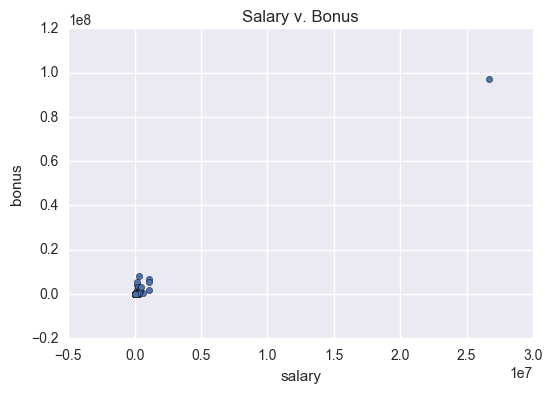

# Overview
The goal of this project was to apply machine learning techniques to identify Enron employees who may have committed fraud based on the public Enron financial and e-mail dataset.

In the original dataset, there were 146 observations and 20 features (not including person-of-interest). This is a supervised learning problem, so each observation was labeled with whether or not the employee was a person of interest (POI). 

Every feature had missing values. These were replaced with zeroes. 

There were two outliers I removed from the dataset: “TOTAL” and “THE TRAVEL AGENCY IN THE PARK.” TOTAL was identified when looking at a scatterplot of salary and bonus, as seen below.

I noticed THE TRAVEL AGENCY IN THE PARK when I was looking through the original spreadsheet of financial information. This didn’t appear to be an employee, so I removed it.

When looking at salary and bonus information, we saw other outliers. For instance, Ken Lay and Jeffrey Skilling both made bonuses of at least 5 million dollars and salary over 1 million dollars. However, since these were valid data points, I chose to leave them in the dataset.

The distribution of POI vs. non-POI was very imbalanced. There were 18 POIs in the dataset versus 126 non-POIs, or a ratio of 7 non-POIs to 1 POI.

# Features Used
The features I used were as follows, with feature importance in parenthesis:

* exercised_stock_options (0.206)
* bonus (0.163)
* shared_receipt_with_poi (0.242)
* deferred_income (0.110)
* fraction_from_poi (0.062)
* fraction_to_poi (0.216)

`fraction_from_poi` and `fraction_to_poi` were features that I engineered. The original dataset had features called `from_poi` and `to_poi`. The intuition is that while persons of interest may have more e-mails from and/or to other persons of interest, however, the percentage of emails sent to/from POIs is more useful than the absolute number. 

I created a correlation matrix of all the features and saw which features correlated most with being a person of interest. I set up a DecisionTreeClassifier and then added features one at a time. If a feature helped performance (see Validation section below for more details), then I’d keep it. If it hurt, then I’d remove it. 

For example:
- I started out with exercised_stock_options, got precision of 0.27, recall of 0.31.
- Adding total_stock_value gave worse performance, precision 0.27 and recall 0.196, so then I omitted it.
- Added bonus, which improved our precision and recall to 0.34191 and 0.41850.

Since I used a DecisionTreeClassifier, I did not need to do any feature scaling. 

# Algorithms
Here are the algorithms I tried, along with their performance metrics:

Naive Bayes: Precision: 0.44764	Recall: 0.34200	F1: 0.38776
Random Forest: Precision: 0.59535	Recall: 0.25600	F1: 0.35804
Decision Tree: Precision: 0.37683	Recall: 0.38700	F1: 0.38185

While Naive Bayes actually performed better than Decision Tree based on F1, I suspected that after some parameter tuning, we could eventually surpass the performance of the Naive Bayes classifier.

# Tuning
Tuning the parameters of an algorithm involves trying out different values for a given machine learning’s input parameters in order to get the best performance. If we don’t do this well, we may end up overfitting to our training set.

I tuned my algorithm by using sklearn’s GridSearchCV, with the following parameter grid:

* criterion: gini, entropy
* max_depth: None, 1, 2
* min_samples_split: 2, 4, 8

# Validation
Validation is about testing whether or not our machine learning algorithm will generalize well, i.e. will work on data we have not yet seen. If we don’t do this well, we may end up with an algorithm that overfits to our training data and doesn’t actually predict well on new data.

The way I validated my analysis was by using the `tester.py` script, which does 1000-fold cross validation.

# Evaluation Metrics
The average performance of my classifier:

Precision: 0.453
Recall: 0.388
F1: 0.418

The precision metric shows that when my classifier predicted that an employee was a person of interest, it was correct around 45% of the time.

The recall metric shows that we were able on average find 38% of the persons of interest in the test set.

The F1 score can be thought of as a weighted average of precision and recall. It’s useful because it gives you one number to look at, as opposed to two.

